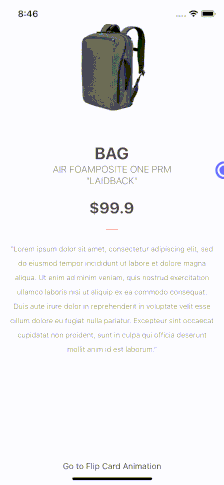

# Experimenting with React and Custom shape animations

The goal was here to test to what degree we can achieve high performance animation in React Native using custom shapes.
In this experiment, the side menu is a custom shape that changes shape during the animation (animatable path). Secondly, the background has a radiant color animation. 

Result shown here (in very low resolution and low color quality):



## Usage

### Install

   ```sh
   yarn
   ```

### Run the project on a specific platform

#### Android/iOS
```sh
yarn android
yarn ios
```
